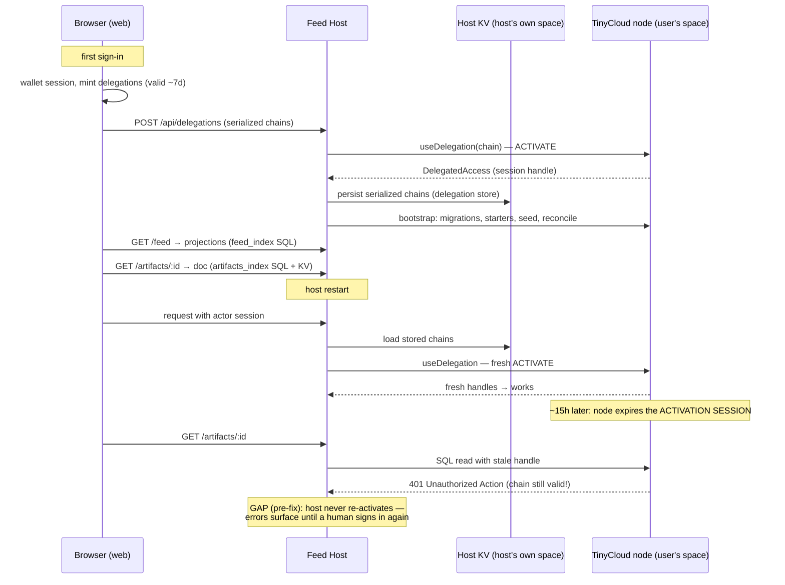

# Delegation lifecycle and feed data flow

Written 2026-07-15 while root-causing "artifacts keep becoming temporarily
unavailable." Per the troubleshooting brief: map how data flows and reloads,
state the invariants, find the architectural gap, fix it.

## Invariants (the product goals)

1. **Every feed load shows existing data, basically instantly.**
2. **The user never loses access to their data** while their delegations are
   valid — no error state that only a manual re-sign-in clears.

## How the data flows

## The gap

Three lifetimes exist and only two were handled:

| Thing | Lifetime | Handled by |
|---|---|---|
| Delegation chain | days (explicit expiry) | store + client re-mint at sign-in |
| Host process | until restart | delegation store restore (re-activate) |
| **Node activation session** | **hours (implicit)** | **nothing — the gap** |

The host treated `useDelegation` as one-shot per actor per process: handles
were captured at activation and reused indefinitely. When the node expired the
session behind a handle, every operation on that resource returned
`401 Unauthorized Action` even though the stored chain remained valid — proven
by a controlled experiment (stale handle failing while a fresh activation of
the same serialized chain read the same table successfully).

Field signature: artifacts decay to "temporarily unavailable" hours after
sign-in; a re-sign-in "fixes" it (because it forces a fresh activation), so it
looks like a data or delegation problem when it is a session-lifetime problem.

## The fix — self-healing access

`host/server.ts`:

- `selfHealingAccess(actor, path)` wraps every resource handle used by
  `actorStorage`. Operations resolve the *current* handle at call time; an
  unauthorized result (`401 Unauthorized Action` / `AUTH_UNAUTHORIZED`)
  triggers `actor.heal()` and one retry.
- `reactivateActorAccess` re-activates the actor's stored chains from the
  delegation store (single-flight per actor: concurrent failures share one
  re-activation) and swaps the fresh handles into `accessByResource`.
- If healing is impossible (no store, chain truly expired/revoked), the
  original error surfaces, the host maps it to a recoverable 403 `denied`,
  and the web client's delegation recovery re-submits — the final fallback.

Layered defenses now: node session expiry → host self-heals (invisible);
chain expiry/revocation → client recovery re-submits (one prompt at most);
both → sign-in screen with plain-language copy.

## Open questions for the node team

- What is the intended activation-session TTL, and is it documented? The host
  now tolerates any TTL, but a `SESSION_EXPIRED` error code distinct from
  authorization denial would let us avoid a probe round-trip and would make
  logs truthful.
- Whether `useDelegation` can return the session TTL so hosts can re-activate
  proactively instead of reactively.
